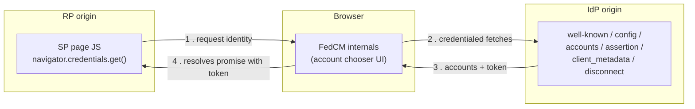

# 1. What FedCM Is, and Why It's Shaped This Way

## The problem it replaces

Before FedCM, "Sign in with X" buttons were built on OAuth/OIDC redirects plus third-party
cookies: the RP's page would embed an IdP iframe or redirect through the IdP, and that iframe
needed its own first-party cookie to be *readable in a third-party context* so it could tell who
was signed in. Browsers are removing third-party cookies, which breaks this pattern, but it also
happened to be a major cross-site tracking vector: any IdP-like embed could silently correlate a
user's identity across every RP that embedded it.

FedCM's goal is to keep the "federated sign-in" experience while removing that tracking surface.
It does this by moving the identity handshake **into the browser itself**, so neither side's
JavaScript ever directly sees the other's cookies, and the browser can rate-limit or gate the
whole thing behind explicit user action.

## The three parties

- **RP (Relying Party)**: the site the user is trying to sign into. In this repo: `internal/sp`,
  `http://localhost:8081`. It calls `navigator.credentials.get()` and never talks to the IdP
  directly.
- **IdP (Identity Provider)**: the account authority. In this repo: `internal/idp`,
  `http://localhost:8080`. It exposes a fixed set of well-known JSON endpoints and never talks to
  the RP directly either.
- **The browser**: the actual client of the IdP's endpoints. It fetches them (attaching the IdP's
  own cookies, which is fine since that's a first-party request from the browser's point of view),
  and it renders the account-chooser UI natively, outside either page's DOM, so neither page can
  screenshot, style, or script it.

So the RP's JS never sees an IdP cookie, and the IdP's endpoints never see an RP cookie. All the
browser hands back to the RP is an opaque token (a JWT, in this demo) that the *IdP* minted and
the *RP* has to independently verify.

## Vocabulary used throughout the other docs

| Term | Meaning |
|---|---|
| **`client_id`** | How the IdP identifies the RP. Some IdPs issue real client IDs; this demo just uses the RP's origin string, `http://localhost:8081`. |
| **config URL** | The IdP's single JSON document (`/fedcm.json` here) listing all its other endpoint URLs. |
| **well-known file** | `/.well-known/web-identity`, which proves the IdP origin actually owns that config URL. Fetched *without* credentials, and must not redirect. |
| **mediation** | How much the browser is allowed to do without a user gesture. `"optional"` (the default) shows UI if it needs to; `"silent"` fails instead of showing UI, which is what auto re-authentication on return visits relies on. |
| **grant / consent** | The record that a specific user has agreed to share their profile with a specific RP. This drives whether the browser can skip the "Continue as ___" consent screen, and whether silent mediation can succeed at all. |
| **Login Status API** | A signal the IdP sends the browser (here, via the `Set-Login` response header) saying "a user is/isn't signed in to me right now." The browser uses this to decide whether it's even worth trying the accounts endpoint for this IdP. |
| **quiet period** | An anti-abuse cooldown the browser enforces after any sign-in (silent or explicit): silent mediation keeps failing for a while afterward even with a valid grant, so a site can't chain silent `get()` calls to repeatedly probe "is this user still logged in." |
| **`IdentityCredential.disconnect()`** | The RP-initiated API for revoking its own grant, basically "unlink my account from this IdP," similar to an OAuth app revoking its own token. |

FedCM is often introduced alongside OAuth/OIDC terms like these, so it's easy to assume it's just a
newer version of the same thing. It isn't, and the two diverge in some fairly important ways: see
[05-fedcm-vs-oauth-oidc.md](05-fedcm-vs-oauth-oidc.md) for exactly where.

## Why so many separate endpoints?

Each endpoint carries a different trust/credential level, and FedCM keeps them separate so the
browser can apply different rules to each:

- **Uncredentialed, no RP context** (well-known, config): safe to fetch before the browser even
  knows which RP is asking. This is purely for bootstrapping "does this IdP exist and is it
  configured correctly."
- **Uncredentialed, RP-aware** (client metadata): safe to expose, since privacy policy links
  aren't sensitive, but it *is* fetched with knowledge of which RP is asking. That's exactly why
  newer Chrome/Edge versions require the well-known file to also pin `accounts_endpoint`/
  `login_url`: otherwise an IdP could quietly serve different account data per RP without that
  being visible anywhere outside an RP-specific context, which would reopen a tracking channel.
- **Credentialed, not RP-aware** (accounts): this is the one that reads the IdP's session cookie,
  so it deliberately does *not* get told the RP's identity. That stops the IdP from tailoring the
  account list per RP in a way that could fingerprint the user.
- **Credentialed, RP-aware, mutating** (assertion, disconnect): these need to know which RP so the
  IdP can record or revoke a grant, and both are POSTs (state-changing), gated behind either an
  actual account-chooser selection (assertion) or an explicit RP-side API call (disconnect).

The next two docs walk through implementing each of these, endpoint by endpoint.
