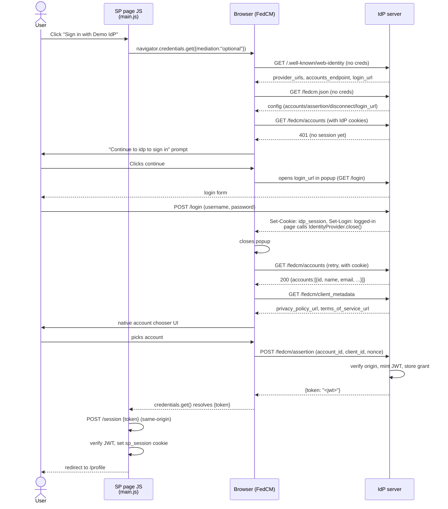
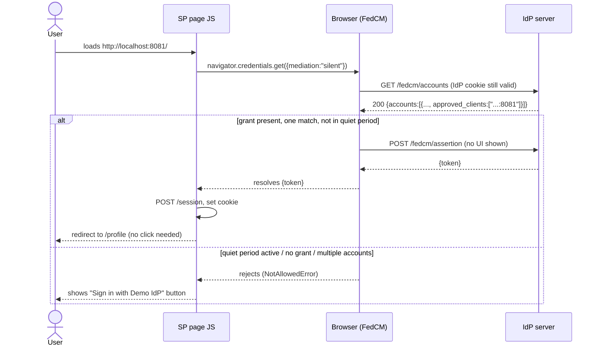
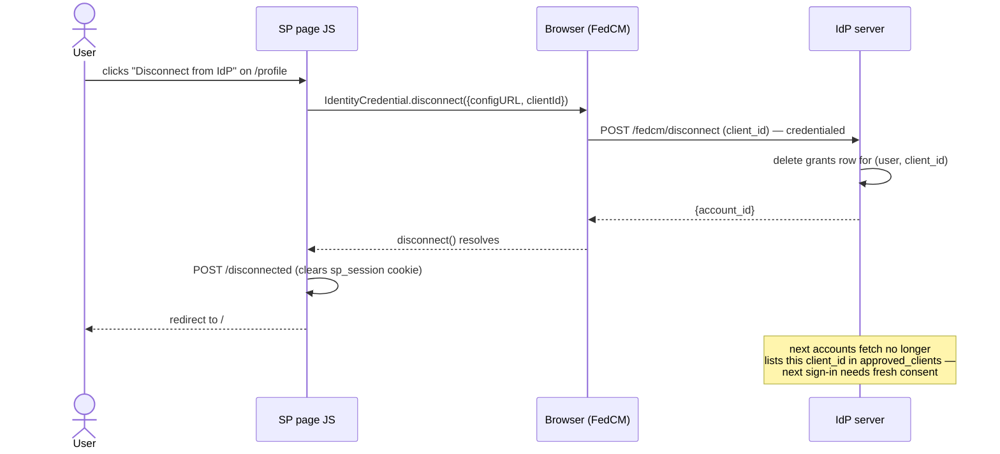
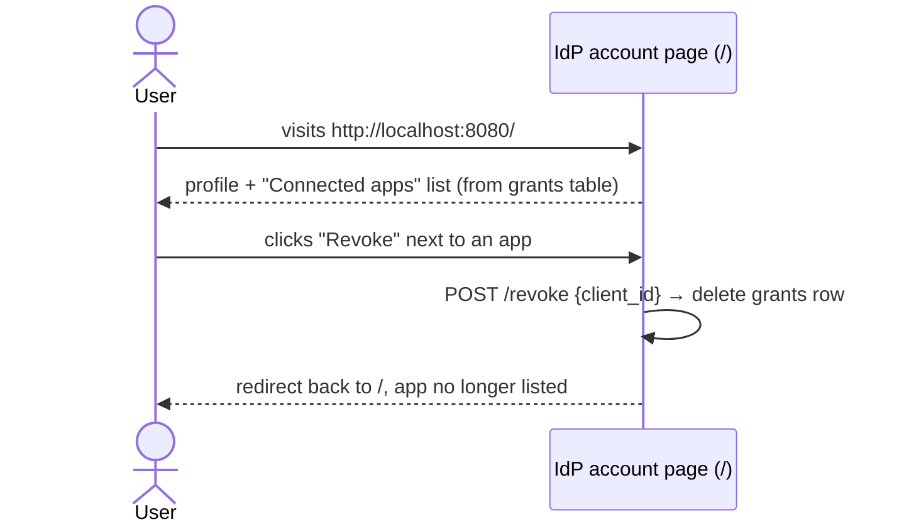

# 4. Sequence Diagrams

These trace the four flows this demo exercises. "Browser (FedCM)" represents the browser's
internal FedCM machinery: the account chooser UI, and the fetches it makes on the RP's behalf. That's
also why the RP and IdP columns never message each other directly.

## 4.1 First-time sign-in (no existing IdP session, no prior grant)

## 4.2 Returning user — silent auto re-authentication

## 4.3 Disconnect (RP-initiated revocation)

## 4.4 IdP-side self-service revoke (not a FedCM API — plain HTML)

This is the mirror image of §4.3: the same `grants` row can be deleted either by the RP calling
`IdentityCredential.disconnect()`, or by the user acting directly on the IdP's own account page.
The second path matters when the user doesn't want to visit every RP individually to revoke
access.
